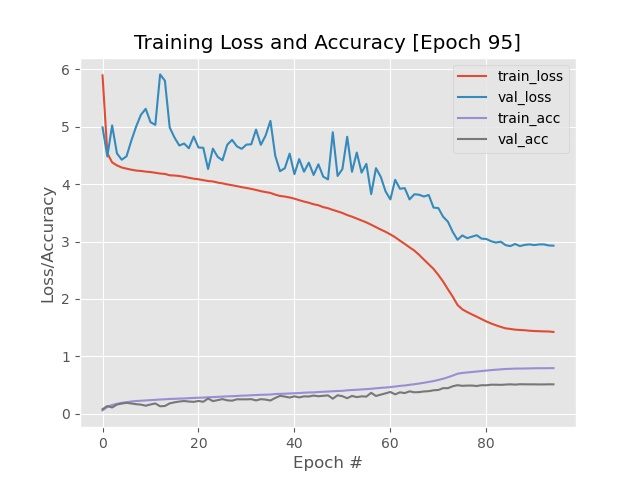

# ResNet-on-Tiny-Imagenet-from-scratch
In this project I built and trained a ResNet model from scratch on Standford's tiny imagenet dataset which is used in their CNN course.

# Requirements and Steps to Run:
This project uses a similar implementation to my GoogLeNet project. Refer <a href="https://github.com/ankit16-py/GoogLeNet-on-Tiny-ImageNet-from-scratch">here</a> for more details.

# Methodology
While training the ResNet model I conducted experiments with two optimizers; Adam and SGD. While Adam gave stability to training, I noticed that it trained the model very slowly (10% accuracy was received after 35 epochs). So I switched to a SGD optimizer with nesterov's acceleration turned on and a momentum of 0.9. I immediately noticed that training was much faster (10% accuracy achieved after 10-12 epochs). 

For ResNet I noticed significant overfitting when I abruptly dropped the learning rate by an order of magnitude of 1e-1. The losses would decrease and then flatten out quickly as the training stagnated later on. Looking at this I decided to use a linearly decaying learning rate for 75 epochs and then a quadratic decay after 75 to 95 epochs. As expected the accuracies where much higher. I achieved a rank-1 and rank-5 accuracy of <b>52.32%</b> and <b>76.05%</b> respectively. According to the information <a href="https://tiny-imagenet.herokuapp.com/">here</a> I stand in the 7th position in the leaderboards (this information may change as I have not tested on the actual testing set provided by Standford. Since I am not enrolled as a student, I used a part of the training set for testing purposes.)

# Output
Below is the training graph of the model and the outs folder stores the best model.

